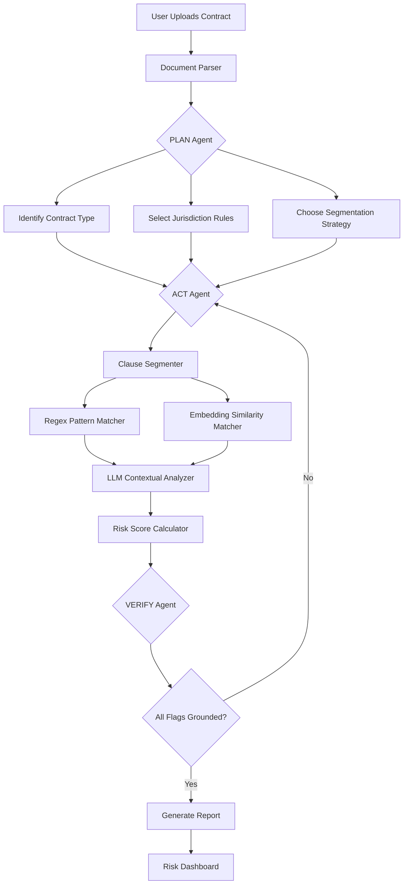

# Product Requirements Document (PRD)
# Legal NDA & Contract Risk Flagging Agent
### Agentic AI + GenAI | CodeFiesta Hackathon 2026

---

**Team:** AlgoVibes (4 members)  
**Hackathon:** CodeFiesta — 24-Hour Hackathon @ GIT Jaipur  
**Problem Statement #02:** Legal NDA & Low-Complexity Contract Risk Flagging Agent with Clause Library  
**Date:** October 8, 2026  
**Version:** 1.0

---

## Table of Contents

1. [Executive Summary](#1-executive-summary)
2. [Problem Statement](#2-problem-statement)
3. [Target Users & Personas](#3-target-users--personas)
4. [Goals & Success Metrics](#4-goals--success-metrics)
5. [Product Overview & Architecture](#5-product-overview--architecture)
6. [Agentic AI Pipeline (Core Logic)](#6-agentic-ai-pipeline-core-logic)
7. [Feature Requirements](#7-feature-requirements)
8. [Clause Library & Risk Knowledge Base](#8-clause-library--risk-knowledge-base)
9. [Tech Stack](#9-tech-stack)
10. [Data Flow & Sequence Diagram](#10-data-flow--sequence-diagram)
11. [API Design](#11-api-design)
12. [UI/UX Wireframe Spec](#12-uiux-wireframe-spec)
13. [Risk Scoring Model](#13-risk-scoring-model)
14. [Jurisdiction Support](#14-jurisdiction-support)
15. [Non-Functional Requirements](#15-non-functional-requirements)
16. [MVP Scope (24-Hour Hackathon)](#16-mvp-scope-24-hour-hackathon)
17. [Future Roadmap (Post-Hackathon)](#17-future-roadmap-post-hackathon)
18. [Team Allocation](#18-team-allocation)
19. [Risk & Mitigation](#19-risk--mitigation)
20. [Appendix](#20-appendix)

---

## 1. Executive Summary

**ContractShield AI** is an agentic AI-powered contract risk analysis platform that helps startups, freelancers, and non-lawyers identify hidden legal risks in NDAs and low-complexity contracts. The agent autonomously parses uploaded documents (PDF/DOCX), segments them into clauses, applies jurisdiction-aware risk pattern matching, flags dangerous provisions, suggests safer alternatives, and computes an overall risk score — all without requiring legal expertise from the user.

The system follows a **Plan → Act → Verify** agentic loop powered by GenAI (LLM) for reasoning and contextual understanding, combined with deterministic tools (regex, embeddings, clause library) for precision and auditability.

---

## 2. Problem Statement

### The Pain

Startups sign dozens of NDAs and simple contracts every quarter. Most founders, freelancers, and small business owners are **non-lawyers** who:

- Miss **unlimited liability** clauses buried in dense legal text
- Overlook **auto-renewal traps** that lock them into unfavorable terms
- Don't notice **one-sided indemnification** that shifts all risk to them
- Fail to catch **non-compete overreach** that restricts future business
- Sign contracts with **ambiguous IP ownership** provisions
- Accept **unfair termination clauses** with no cure period

### The Cost

- Average startup spends **\$10,000–\$30,000/year** on basic contract review
- A single missed clause can result in **\$50K–\$500K** in liability
- 67% of small businesses have signed contracts they later regretted (Source: LegalZoom 2024 Survey)

### Our Solution

An **autonomous AI agent** that reads contracts like a junior lawyer — flagging risks, citing exact problematic language, suggesting alternatives, and scoring overall risk — in under 60 seconds.

---

## 3. Target Users & Personas

| Persona | Description | Key Need |
|---------|-------------|----------|
| **Startup Founder** | Non-technical, signs 5–15 NDAs/month with vendors, partners, investors | Quick risk summary before signing |
| **Freelancer/Contractor** | Signs client service agreements, NDAs | Understand what they're committing to |
| **Small Business Owner** | Lease agreements, vendor contracts, employment NDAs | Flag unfair terms without a lawyer |
| **Legal Intern/Paralegal** | Reviews contracts in bulk for a law firm | Speed up first-pass review |
| **Procurement Manager** | Reviews vendor/supplier contracts | Ensure compliance with company policy |

---

## 4. Goals & Success Metrics

### Primary Goals (Hackathon MVP)

| Goal | Metric | Target |
|------|--------|--------|
| Parse contracts accurately | Clause extraction accuracy | ≥ 85% |
| Flag genuine risks | Risk detection precision | ≥ 80% |
| Fast turnaround | End-to-end processing time | < 60 seconds |
| User-friendly output | Risk report clarity (demo feedback) | Positive qualitative feedback |
| Jurisdiction awareness | Support multiple jurisdictions | ≥ 3 (India, US, UK) |

### Secondary Goals

| Goal | Metric | Target |
|------|--------|--------|
| Actionable suggestions | Alternative clause suggestions per risk | ≥ 1 per flag |
| Clause library coverage | Pre-built risky clause patterns | ≥ 50 patterns |
| Overall risk score | Weighted composite score | 0–100 scale |

---

## 5. Product Overview & Architecture

### High-Level Architecture

```
┌─────────────────────────────────────────────────────────┐
│                    FRONTEND (React/Next.js)              │
│  ┌──────────┐  ┌──────────────┐  ┌───────────────────┐  │
│  │ Upload   │  │ Risk Report  │  │ Clause Library    │  │
│  │ Panel    │  │ Dashboard    │  │ Browser           │  │
│  └──────────┘  └──────────────┘  └───────────────────┘  │
└─────────────────────────┬───────────────────────────────┘
                          │ REST API / WebSocket
┌─────────────────────────▼───────────────────────────────┐
│                    BACKEND (FastAPI / Python)             │
│  ┌──────────────────────────────────────────────────┐   │
│  │              AGENTIC ORCHESTRATOR                 │   │
│  │  ┌────────┐  ┌────────┐  ┌────────┐  ┌────────┐ │   │
│  │  │ PLAN   │→ │ ACT    │→ │VERIFY  │→ │REPORT  │ │   │
│  │  └────────┘  └────────┘  └────────┘  └────────┘ │   │
│  └──────────────────────────────────────────────────┘   │
│                                                          │
│  ┌──────────┐  ┌──────────┐  ┌──────────┐  ┌────────┐  │
│  │ Document │  │ Clause   │  │ Risk     │  │ GenAI  │  │
│  │ Parser   │  │ Segmenter│  │ Matcher  │  │ Engine │  │
│  └──────────┘  └──────────┘  └──────────┘  └────────┘  │
│                                                          │
│  ┌──────────────────────────────────────────────────┐   │
│  │         CLAUSE LIBRARY & KNOWLEDGE BASE           │   │
│  │  (Risk patterns, safe alternatives, jurisdiction  │   │
│  │   rules, embeddings index)                        │   │
│  └──────────────────────────────────────────────────┘   │
└─────────────────────────────────────────────────────────┘
```

---

## 6. Agentic AI Pipeline (Core Logic)

The system follows a structured **agentic loop** with four phases, mirroring the hackathon problem statement's requirements:

### Phase 1: INPUT — Document Ingestion & Metadata

**Trigger:** User uploads a contract file with metadata.

| Input Field | Type | Required | Description |
|-------------|------|----------|-------------|
| `document` | File (PDF/DOCX) | ✅ | The contract document |
| `contract_type` | Enum | ✅ | NDA, Service Agreement, Freelance Contract, Employment, Lease, Vendor |
| `parties` | List[String] | ✅ | Names of signing parties (e.g., ["Acme Corp", "John Doe"]) |
| `jurisdiction` | Enum | ✅ | India, US-California, US-Delaware, US-New York, UK, EU-GDPR |
| `user_role` | Enum | Optional | Which party the user represents (Party A / Party B) |
| `industry` | Enum | Optional | Tech, Healthcare, Finance, Real Estate, General |

### Phase 2: PLAN — Agentic Planning

The agent autonomously decides an analysis strategy:

```
PLAN Agent Reasoning:
1. Identify contract type → NDA (Mutual vs One-Way)
2. Load jurisdiction-specific rule set → Indian Contract Act, 1872
3. Determine clause segmentation approach:
   - If well-structured (numbered sections) → regex-based segmenter
   - If unstructured (prose-heavy) → LLM-based segmenter
4. Select risk patterns to evaluate:
   - NDA-specific: confidentiality scope, term, exclusions, remedies
   - General: liability caps, indemnification, termination, IP, non-compete
5. Prioritize analysis order: high-risk clauses first
```

**Plan Output (Internal JSON):**
```json
{
  "contract_type_detected": "mutual_nda",
  "segmentation_strategy": "hybrid",
  "jurisdiction_ruleset": "india_contract_act",
  "analysis_modules": [
    "confidentiality_scope",
    "liability_caps",
    "indemnification",
    "term_and_termination",
    "ip_ownership",
    "non_compete",
    "auto_renewal",
    "governing_law",
    "dispute_resolution"
  ],
  "estimated_clauses": 12
}
```

### Phase 3: ACT — Risk Analysis & Flagging

For each clause, the agent performs:

#### 3a. Clause Segmentation
- **Regex-based:** Match numbered/lettered sections (e.g., `Section 1.`, `Article II`, `Clause (a)`)
- **LLM-based fallback:** Prompt the LLM to identify clause boundaries in unstructured text
- **Hybrid:** Use regex first, then LLM for edge cases

#### 3b. Risk Pattern Matching (Dual Approach)

**Deterministic Layer (Regex + Rules):**
```python
RISK_PATTERNS = {
    "unlimited_liability": {
        "patterns": [
            r"unlimited\s+liability",
            r"no\s+cap\s+on\s+(liability|damages)",
            r"liable\s+for\s+all\s+(damages|losses)",
            r"without\s+limitation"
        ],
        "severity": "critical",
        "category": "liability"
    },
    "auto_renewal": {
        "patterns": [
            r"auto(matically)?\s*renew",
            r"shall\s+renew\s+for\s+successive",
            r"unless\s+terminated\s+\d+\s+days\s+(prior|before)"
        ],
        "severity": "high",
        "category": "term"
    }
    # ... 50+ patterns
}
```

**Semantic Layer (Embeddings + LLM):**
- Embed each clause using a sentence transformer
- Compare against a pre-built vector index of known risky clauses
- Use cosine similarity threshold (≥ 0.78) to flag semantic matches
- Send flagged clauses to LLM for contextual risk assessment

#### 3c. Risk Flagging Output

For each flagged risk, the agent produces:

```json
{
  "clause_id": "section_4_2",
  "clause_title": "Limitation of Liability",
  "clause_text": "The Receiving Party shall be liable for all direct, indirect, consequential, and incidental damages without limitation...",
  "risk_type": "unlimited_liability",
  "severity": "critical",
  "confidence": 0.94,
  "explanation": "This clause imposes unlimited liability on the Receiving Party for all types of damages including consequential damages. This is highly unusual and exposes you to uncapped financial risk.",
  "problematic_language": "liable for all direct, indirect, consequential, and incidental damages without limitation",
  "suggested_alternative": "The Receiving Party's total aggregate liability shall not exceed the fees paid under this Agreement in the twelve (12) months preceding the claim, excluding liability for willful misconduct or breach of confidentiality.",
  "jurisdiction_note": "Under Indian Contract Act Section 73, damages must be proximate and foreseeable. This clause may be challengeable as unconscionable.",
  "risk_score_contribution": 25
}
```

#### 3d. Overall Risk Score Computation

```
Risk Score = Σ (clause_risk_weight × severity_multiplier × confidence) / max_possible_score × 100

Severity Multipliers:
  - Critical: 4.0
  - High: 3.0
  - Medium: 2.0
  - Low: 1.0
  - Info: 0.5

Risk Bands:
  0–25:  🟢 Low Risk — Safe to sign with minor review
  26–50: 🟡 Medium Risk — Review flagged clauses before signing
  51–75: 🟠 High Risk — Negotiate changes before signing
  76–100: 🔴 Critical Risk — Do NOT sign without legal counsel
```

### Phase 4: VERIFY — Grounding & Validation

The agent self-verifies before producing the final report:

| Verification Check | Method | Pass Criteria |
|-------------------|--------|---------------|
| **Segmentation accuracy** | Compare clause count with expected range for contract type | ±20% of expected |
| **Flag grounding** | Every flag must cite exact text from the document | 100% grounded |
| **Jurisdiction rules applied** | Check jurisdiction-specific patterns were used | All applicable rules checked |
| **No hallucinated clauses** | LLM flags must map to actual document text | 0 hallucinated references |
| **Severity calibration** | Cross-check severity against clause library benchmarks | No severity overrides without justification |
| **Score sanity check** | Total score within expected range for contract type | Within historical range |

---

## 7. Feature Requirements

### FR-01: Document Upload & Parsing

| ID | Requirement | Priority | Details |
|----|-------------|----------|---------|
| FR-01.1 | Support PDF upload | P0 | Use PyMuPDF/pdfplumber for text extraction |
| FR-01.2 | Support DOCX upload | P0 | Use python-docx for text extraction |
| FR-01.3 | Handle scanned PDFs | P2 | OCR fallback with Tesseract (stretch goal) |
| FR-01.4 | Extract metadata | P0 | Detect parties, dates, contract type from header |
| FR-01.5 | File size limit | P0 | Max 10MB, max 50 pages |
| FR-01.6 | Multi-file upload | P2 | Batch analysis (post-MVP) |

### FR-02: Clause Segmentation

| ID | Requirement | Priority | Details |
|----|-------------|----------|---------|
| FR-02.1 | Regex-based segmentation | P0 | Handle numbered sections, articles, clauses |
| FR-02.2 | LLM-based segmentation | P0 | Fallback for unstructured documents |
| FR-02.3 | Clause labeling | P0 | Assign semantic labels (e.g., "Confidentiality", "Term") |
| FR-02.4 | Nested clause handling | P1 | Handle sub-clauses (1.1, 1.2, 1(a), 1(b)) |

### FR-03: Risk Detection & Flagging

| ID | Requirement | Priority | Details |
|----|-------------|----------|---------|
| FR-03.1 | Regex pattern matching | P0 | 50+ pre-built risk patterns |
| FR-03.2 | Semantic embedding matching | P0 | Vector similarity against clause library |
| FR-03.3 | LLM contextual analysis | P0 | GenAI reasoning for nuanced risks |
| FR-03.4 | Severity classification | P0 | Critical / High / Medium / Low / Info |
| FR-03.5 | Problematic text citation | P0 | Highlight exact risky language |
| FR-03.6 | Alternative suggestions | P0 | Suggest safer clause wording |
| FR-03.7 | Risk score computation | P0 | Weighted composite 0–100 score |
| FR-03.8 | Jurisdiction-specific rules | P0 | Apply region-specific legal rules |

### FR-04: Report Generation

| ID | Requirement | Priority | Details |
|----|-------------|----------|---------|
| FR-04.1 | Interactive risk report | P0 | Web-based dashboard with expandable cards |
| FR-04.2 | Risk summary header | P0 | Overall score, risk band, key stats |
| FR-04.3 | Clause-by-clause breakdown | P0 | Expandable sections per clause |
| FR-04.4 | PDF report export | P1 | Downloadable PDF summary |
| FR-04.5 | Side-by-side comparison | P2 | Original text vs suggested changes |

### FR-05: Clause Library

| ID | Requirement | Priority | Details |
|----|-------------|----------|---------|
| FR-05.1 | Browse clause categories | P1 | Filterable by contract type & risk category |
| FR-05.2 | View safe vs risky examples | P1 | Side-by-side comparison |
| FR-05.3 | Search clauses | P1 | Full-text search across library |
| FR-05.4 | Community contributions | P2 | Users can submit clause patterns (post-MVP) |

### FR-06: Chat Interface (Agentic Interaction)

| ID | Requirement | Priority | Details |
|----|-------------|----------|---------|
| FR-06.1 | Ask questions about the contract | P1 | "What's the termination notice period?" |
| FR-06.2 | Request deeper analysis | P1 | "Explain the indemnification clause" |
| FR-06.3 | Compare with standard templates | P2 | "How does this NDA compare to a standard mutual NDA?" |

---

## 8. Clause Library & Risk Knowledge Base

### Risk Categories & Patterns (Sample — 50+ in full library)

#### Category: Liability

| Pattern Name | Severity | Regex Trigger | Description |
|-------------|----------|---------------|-------------|
| Unlimited Liability | 🔴 Critical | `unlimited liability`, `no cap on damages` | No upper bound on financial exposure |
| Consequential Damages | 🟠 High | `consequential`, `indirect damages` | Exposure to unpredictable losses |
| Missing Liability Cap | 🟠 High | Absence of `not exceed`, `aggregate liability` | No explicit ceiling stated |

#### Category: Term & Renewal

| Pattern Name | Severity | Regex Trigger | Description |
|-------------|----------|---------------|-------------|
| Auto-Renewal Trap | 🟠 High | `auto-renew`, `successive periods` | Locks you in without active opt-out |
| Perpetual Term | 🔴 Critical | `perpetual`, `in perpetuity`, `no expiration` | Never-ending obligation |
| Short Notice Termination | 🟡 Medium | `terminate.*\d+\s*days` (< 30 days) | Insufficient notice period |

#### Category: Indemnification

| Pattern Name | Severity | Regex Trigger | Description |
|-------------|----------|---------------|-------------|
| One-Sided Indemnification | 🔴 Critical | `shall indemnify` (only one party) | Only you bear the defense cost |
| Broad Indemnification | 🟠 High | `any and all claims`, `whatsoever` | Overly broad scope |
| Missing Carve-outs | 🟡 Medium | Absence of `except`, `excluding` in indemnity clause | No exceptions to indemnity obligation |

#### Category: Intellectual Property

| Pattern Name | Severity | Regex Trigger | Description |
|-------------|----------|---------------|-------------|
| IP Assignment (all work) | 🔴 Critical | `assign.*all.*intellectual property` | Gives away all your IP |
| Work-for-Hire Overreach | 🟠 High | `work(s)?\s+for\s+hire`, `work(s)?\s+made\s+for\s+hire` | Broad IP ownership claim |
| Pre-existing IP Risk | 🟡 Medium | Absence of `pre-existing`, `background IP` | No protection for your existing IP |

#### Category: Non-Compete / Non-Solicitation

| Pattern Name | Severity | Regex Trigger | Description |
|-------------|----------|---------------|-------------|
| Broad Non-Compete | 🔴 Critical | `not compete.*worldwide`, `any business` | Unreasonably broad restriction |
| Extended Non-Compete Period | 🟠 High | `non-compete.*\d+\s*(year|month)` (> 2 years) | Excessive time restriction |
| Non-Solicit Overreach | 🟡 Medium | `not.*solicit.*any.*employee` | Prevents hiring from large company |

#### Category: Confidentiality (NDA-Specific)

| Pattern Name | Severity | Regex Trigger | Description |
|-------------|----------|---------------|-------------|
| Overly Broad Definition | 🟠 High | `all information`, `any and all` (in confidentiality definition) | Everything becomes confidential |
| Missing Exclusions | 🟠 High | Absence of `publicly known`, `independently developed` | Standard carve-outs missing |
| Perpetual Confidentiality | 🟡 Medium | `indefinitely`, `survive.*termination.*perpetuity` | Obligation never expires |
| No Return/Destroy Provision | 🟡 Medium | Absence of `return`, `destroy` (upon termination) | No mechanism to end obligations |

#### Category: Dispute Resolution

| Pattern Name | Severity | Regex Trigger | Description |
|-------------|----------|---------------|-------------|
| Unfavorable Forum | 🟡 Medium | `courts of [distant jurisdiction]` | Must litigate far from your location |
| Waiver of Jury Trial | 🟡 Medium | `waive.*jury.*trial` | Gives up right to jury |
| Mandatory Arbitration | 🟡 Medium | `binding arbitration`, `shall be arbitrated` | No court access |

#### Category: Penalty & Damages

| Pattern Name | Severity | Regex Trigger | Description |
|-------------|----------|---------------|-------------|
| Excessive Liquidated Damages | 🟠 High | `liquidated damages.*\$[\d,]+` (disproportionate) | Predetermined penalty amount |
| Penalty Clause | 🟠 High | `penalty`, `forfeit` | Punitive rather than compensatory |
| Lost Profits Inclusion | 🟡 Medium | `lost profits`, `loss of business` | Speculative damages included |

#### Category: Data & Privacy

| Pattern Name | Severity | Regex Trigger | Description |
|-------------|----------|---------------|-------------|
| Broad Data Rights | 🟠 High | `right to use.*data`, `collect.*all.*data` | Grants excessive data access |
| No Data Deletion | 🟡 Medium | Absence of `delete`, `purge` (in data clauses) | No mechanism to remove your data |
| Cross-border Transfer | 🟡 Medium | `transfer.*outside`, `any jurisdiction` | Data may leave your country |

---

## 9. Tech Stack

### MVP Tech Stack (Optimized for 24-hour hackathon)

| Layer | Technology | Justification |
|-------|-----------|---------------|
| **Frontend** | Next.js 14 + Tailwind CSS + shadcn/ui | Rapid UI development, modern look |
| **Backend** | FastAPI (Python 3.11+) | Async, fast, great for AI pipelines |
| **LLM / GenAI** | Google Gemini 1.5 Flash / Pro (via API) | Free tier available, multimodal, fast |
| **Embeddings** | `all-MiniLM-L6-v2` (sentence-transformers) | Lightweight, fast, no GPU needed |
| **Vector Store** | ChromaDB (in-memory) | Zero-config, Python-native |
| **PDF Parsing** | PyMuPDF (`fitz`) + `pdfplumber` | Robust text extraction |
| **DOCX Parsing** | `python-docx` | Native DOCX support |
| **Regex Engine** | Python `re` module | Built-in, fast |
| **Agent Framework** | LangGraph or custom Python orchestrator | Agentic loop with state management |
| **Database** | SQLite (file-based) | Zero-config, sufficient for demo |
| **Deployment** | Vercel (frontend) + Railway/Render (backend) | Free tier, instant deploy |

### Alternative Stack Options

| Component | Alternative | When to Use |
|-----------|-------------|-------------|
| LLM | OpenAI GPT-4o-mini | If Gemini quota is exhausted |
| LLM | Groq (Llama 3.1 70B) | If need fastest inference |
| Agent Framework | CrewAI | If want multi-agent architecture |
| Frontend | Streamlit | If want to skip frontend dev entirely |
| Vector Store | FAISS | If ChromaDB has issues |

---

## 10. Data Flow & Sequence Diagram

### End-to-End Data Flow

```
User                  Frontend              Backend                AI Engine
 │                       │                     │                       │
 │──Upload Contract──────▶                     │                       │
 │  (PDF + metadata)     │                     │                       │
 │                       │──POST /analyze──────▶                       │
 │                       │  {file, type,       │                       │
 │                       │   parties, juris}   │                       │
 │                       │                     │──Parse Document───────▶
 │                       │                     │  (PyMuPDF/python-docx)│
 │                       │                     │◀──Raw Text────────────│
 │                       │                     │                       │
 │                       │                     │──PLAN Phase───────────▶
 │                       │                     │  (LLM: identify type, │
 │                       │                     │   pick strategy)      │
 │                       │                     │◀──Analysis Plan───────│
 │                       │                     │                       │
 │                       │                     │──ACT Phase────────────▶
 │                       │                     │  (Segment → Match →   │
 │                       │                     │   Score per clause)   │
 │                       │                     │◀──Risk Flags──────────│
 │                       │                     │                       │
 │                       │                     │──VERIFY Phase─────────▶
 │                       │                     │  (Ground flags,       │
 │                       │                     │   validate scores)    │
 │                       │                     │◀──Verified Report─────│
 │                       │                     │                       │
 │                       │◀──Risk Report JSON──│                       │
 │◀──Render Dashboard────│                     │                       │
 │  (Risk score, flags,  │                     │                       │
 │   suggestions)        │                     │                       │
```

### Agentic Loop Detail



### WebSocket for Real-Time Progress (Stretch Goal)

```
Progress Events:
  → "Parsing document..."         (10%)
  → "Segmenting clauses..."       (25%)
  → "Analyzing clause 3/12..."    (50%)
  → "Computing risk score..."     (85%)
  → "Verifying results..."        (95%)
  → "Report ready!"              (100%)
```

---

## 11. API Design

### Core Endpoints

#### `POST /api/v1/analyze`

Upload and analyze a contract.

**Request (multipart/form-data):**
```
document: File (PDF/DOCX, max 10MB)
contract_type: string (enum: nda, service_agreement, freelance, employment, lease, vendor)
parties: string (JSON array: ["Party A", "Party B"])
jurisdiction: string (enum: india, us-california, us-delaware, us-newyork, uk, eu)
user_role: string (optional, enum: party_a, party_b)
industry: string (optional, enum: tech, healthcare, finance, real_estate, general)
```

**Response (JSON):**
```json
{
  "analysis_id": "uuid-v4",
  "status": "completed",
  "processing_time_ms": 34200,
  "document_info": {
    "filename": "acme_nda_2026.pdf",
    "pages": 4,
    "word_count": 2847,
    "detected_contract_type": "mutual_nda",
    "detected_parties": ["Acme Corp", "StartupX Inc"]
  },
  "risk_summary": {
    "overall_score": 68,
    "risk_band": "high",
    "risk_label": "🟠 High Risk — Negotiate changes before signing",
    "total_clauses_analyzed": 12,
    "total_risks_found": 7,
    "risk_breakdown": {
      "critical": 2,
      "high": 3,
      "medium": 1,
      "low": 1,
      "info": 0
    }
  },
  "flags": [
    {
      "clause_id": "section_4_2",
      "clause_title": "Limitation of Liability",
      "clause_text": "...",
      "risk_type": "unlimited_liability",
      "severity": "critical",
      "confidence": 0.94,
      "explanation": "...",
      "problematic_language": "...",
      "suggested_alternative": "...",
      "jurisdiction_note": "..."
    }
  ],
  "safe_clauses": [
    {
      "clause_id": "section_1",
      "clause_title": "Definitions",
      "status": "safe",
      "note": "Standard definitions clause with appropriate scope."
    }
  ],
  "verification": {
    "all_flags_grounded": true,
    "jurisdiction_rules_applied": true,
    "segmentation_quality": "high",
    "hallucination_check_passed": true
  }
}
```

#### `GET /api/v1/analysis/{analysis_id}`

Retrieve a previously computed analysis.

#### `GET /api/v1/clause-library`

Browse the clause library.

**Query Parameters:**
```
category: string (optional, e.g., "liability", "indemnification")
contract_type: string (optional)
severity: string (optional)
search: string (optional, full-text search)
```

#### `POST /api/v1/chat`

Ask follow-up questions about an analyzed contract.

**Request:**
```json
{
  "analysis_id": "uuid-v4",
  "question": "Can they sue me if I accidentally share information with my CTO?"
}
```

#### `GET /api/v1/health`

Health check endpoint.

---

## 12. UI/UX Wireframe Spec

### Screen 1: Landing / Upload Page

```
┌────────────────────────────────────────────────────────┐
│  🛡️ ContractShield AI                     [Clause Library]│
│                                                        │
│     "Know What You're Signing"                        │
│                                                        │
│  ┌──────────────────────────────────────────────────┐  │
│  │                                                  │  │
│  │      📄 Drop your contract here                  │  │
│  │         or click to browse                       │  │
│  │                                                  │  │
│  │      Supports: PDF, DOCX (max 10MB)              │  │
│  │                                                  │  │
│  └──────────────────────────────────────────────────┘  │
│                                                        │
│  Contract Type: [ NDA          ▼ ]                     │
│  Parties:       [ Acme Corp    ] [ StartupX Inc   ]   │
│  Jurisdiction:  [ India        ▼ ]                     │
│  Your Role:     [ ○ Party A  ● Party B ]              │
│                                                        │
│            [ 🔍 Analyze Contract ]                     │
│                                                        │
│  ────────────────────────────────────────────────────  │
│  Recent Analyses:                                      │
│  📄 acme_nda.pdf     🟠 68/100    2 min ago           │
│  📄 vendor_sla.docx  🟢 22/100    1 hour ago          │
└────────────────────────────────────────────────────────┘
```

### Screen 2: Analysis in Progress

```
┌────────────────────────────────────────────────────────┐
│  🛡️ ContractShield AI                                  │
│                                                        │
│     Analyzing: acme_nda_2026.pdf                      │
│                                                        │
│     ████████████████░░░░  78%                         │
│                                                        │
│     ✅ Document parsed (4 pages, 2847 words)          │
│     ✅ 12 clauses identified                          │
│     ✅ Analyzing clause 9 of 12...                    │
│     ⏳ Computing risk score                           │
│     ⏳ Verifying results                              │
│                                                        │
│     ⏱️ Estimated time remaining: 12 seconds            │
└────────────────────────────────────────────────────────┘
```

### Screen 3: Risk Report Dashboard

```
┌────────────────────────────────────────────────────────┐
│  🛡️ ContractShield AI    [📥 Export PDF] [💬 Ask AI]   │
│                                                        │
│  ┌──────────────────────────────────────────────────┐  │
│  │  RISK SCORE: 68/100                               │  │
│  │  ████████████████████████████████░░░░░░░░░░░░░    │  │
│  │  🟠 HIGH RISK — Negotiate changes before signing  │  │
│  │                                                    │  │
│  │  📊 2 Critical · 3 High · 1 Medium · 1 Low       │  │
│  │  📄 12 clauses analyzed in 34.2 seconds           │  │
│  └──────────────────────────────────────────────────┘  │
│                                                        │
│  ── RISK FLAGS ────────────────────────────────────── │
│                                                        │
│  🔴 CRITICAL  Section 4.2 — Limitation of Liability   │
│  ┌──────────────────────────────────────────────────┐  │
│  │ ⚠️ Unlimited Liability                            │  │
│  │                                                    │  │
│  │ "The Receiving Party shall be liable for all      │  │
│  │  direct, indirect, consequential, and incidental  │  │
│  │  damages WITHOUT LIMITATION..."                   │  │
│  │          ^^^^^^^^^^^^^^^^^ [highlighted in red]    │  │
│  │                                                    │  │
│  │ 💡 Why this matters:                              │  │
│  │ This clause imposes unlimited liability...         │  │
│  │                                                    │  │
│  │ ✏️ Suggested Alternative:                          │  │
│  │ "Total aggregate liability shall not exceed the   │  │
│  │  fees paid in the preceding 12 months..."         │  │
│  │                                                    │  │
│  │ 🏛️ Jurisdiction Note (India):                      │  │
│  │ Under Indian Contract Act Section 73, damages     │  │
│  │ must be proximate and foreseeable.                 │  │
│  └──────────────────────────────────────────────────┘  │
│                                                        │
│  🟠 HIGH  Section 7.1 — Auto-Renewal                  │
│  ┌──────────────────────────────────────────────────┐  │
│  │ ... (expandable card)                              │  │
│  └──────────────────────────────────────────────────┘  │
│                                                        │
│  ── SAFE CLAUSES ─────────────────────────────────── │
│  ✅ Section 1 — Definitions (Standard)                │
│  ✅ Section 2 — Purpose (Standard)                    │
│  ✅ Section 10 — Notices (Standard)                   │
└────────────────────────────────────────────────────────┘
```

### Screen 4: Clause Library Browser

```
┌────────────────────────────────────────────────────────┐
│  🛡️ ContractShield AI — Clause Library                 │
│                                                        │
│  🔍 Search clauses...                                  │
│                                                        │
│  Filter: [All Types ▼] [All Categories ▼] [All ▼]    │
│                                                        │
│  ── LIABILITY ──────────────────────────────────────  │
│                                                        │
│  ⚠️ Unlimited Liability                               │
│  ┌───────────────────┬────────────────────────────┐   │
│  │ 🔴 Risky Version  │ 🟢 Safe Version            │   │
│  │                   │                            │   │
│  │ "liable for all   │ "aggregate liability shall │   │
│  │  damages without  │  not exceed fees paid in   │   │
│  │  limitation"      │  the preceding 12 months"  │   │
│  └───────────────────┴────────────────────────────┘   │
│                                                        │
│  ⚠️ Consequential Damages                             │
│  ┌───────────────────┬────────────────────────────┐   │
│  │ 🔴 Risky Version  │ 🟢 Safe Version            │   │
│  │ ...               │ ...                        │   │
│  └───────────────────┴────────────────────────────┘   │
└────────────────────────────────────────────────────────┘
```

### Design System

| Element | Spec |
|---------|------|
| **Color Palette** | Dark theme: `#0a0a0a` bg, `#1a1a2e` cards, `#e94560` critical, `#f59e0b` high, `#eab308` medium, `#22c55e` safe |
| **Typography** | Inter (UI), JetBrains Mono (clause text) |
| **Component Library** | shadcn/ui (Radix-based) |
| **Animations** | Framer Motion for card transitions, score gauge animation |
| **Responsiveness** | Mobile-first, breakpoints at 640px, 768px, 1024px |

---

## 13. Risk Scoring Model

### Weighted Risk Score Formula

$$\text{Score} = \min\!\Bigl(100,\;\frac{\sum_{i=1}^{n} W_i \times S_i \times C_i}{N} \times 100\Bigr)$$

Where:
- \(W_i\) = Category weight (see table below)
- \(S_i\) = Severity multiplier (Critical=4, High=3, Medium=2, Low=1)
- \(C_i\) = Confidence score (0.0 to 1.0)
- \(N\) = Normalization factor (max possible score for this contract type)

### Category Weights

| Category | Weight | Rationale |
|----------|--------|-----------|
| Liability | 1.0 | Direct financial exposure |
| Indemnification | 0.95 | Defense and damage costs |
| IP Ownership | 0.90 | Core business asset risk |
| Non-Compete | 0.85 | Future business restrictions |
| Term & Renewal | 0.80 | Lock-in risk |
| Confidentiality Scope | 0.75 | Operational restrictions |
| Termination | 0.70 | Exit flexibility |
| Dispute Resolution | 0.60 | Enforcement risk |
| Governing Law | 0.50 | Jurisdictional convenience |
| Data & Privacy | 0.65 | Regulatory compliance risk |
| Miscellaneous | 0.40 | Low direct impact |

### Risk Band Thresholds

| Score Range | Band | Color | Recommendation |
|-------------|------|-------|----------------|
| 0–25 | Low Risk | 🟢 Green | Safe to sign with minor review |
| 26–50 | Medium Risk | 🟡 Yellow | Review flagged clauses before signing |
| 51–75 | High Risk | 🟠 Orange | Negotiate changes before signing |
| 76–100 | Critical Risk | 🔴 Red | Do NOT sign without legal counsel |

### Example Score Calculation

For a contract with 3 flagged risks:

| Clause | Category | Weight | Severity | Multiplier | Confidence | Contribution |
|--------|----------|--------|----------|------------|------------|-------------|
| Unlimited Liability | Liability | 1.0 | Critical | 4.0 | 0.94 | 3.76 |
| Auto-Renewal | Term | 0.80 | High | 3.0 | 0.87 | 2.09 |
| Broad Non-Compete | Non-Compete | 0.85 | High | 3.0 | 0.72 | 1.84 |
| **Total** | | | | | | **7.69** |

With normalization factor \(N = 12\) (max for NDA): Score = \(\min(100, 7.69 / 12 \times 100) = 64\) → 🟠 High Risk

---

## 14. Jurisdiction Support

### India 🇮🇳
| Law | Relevance |
|-----|-----------|
| Indian Contract Act, 1872 | Validity of contract terms, Section 73 (damages), Section 23 (unlawful agreements) |
| Information Technology Act, 2000 | Data protection clauses, electronic contracts |
| Competition Act, 2002 | Non-compete enforceability (generally unenforceable post-employment) |
| Indian Stamp Act, 1899 | Stamp duty requirements for certain contracts |

**India-Specific Rules:**
- Non-compete clauses post-employment are generally **void** under Section 27 of the Indian Contract Act
- Liquidated damages must be **reasonable** (Section 74)
- Arbitration preferred per the Arbitration and Conciliation Act, 1996
- Digital signatures valid under IT Act, 2000

### United States 🇺🇸 (California, Delaware, New York)

| State | Key Consideration |
|-------|-------------------|
| California | Non-competes generally **unenforceable** (Business & Professions Code §16600) |
| Delaware | Favors contractual freedom, but unconscionability defense available |
| New York | Non-competes enforceable if reasonable in scope, time, and geography |

### United Kingdom 🇬🇧
| Law | Relevance |
|-----|-----------|
| Unfair Contract Terms Act 1977 | Limits exclusion of liability for negligence |
| Consumer Rights Act 2015 | Fairness of terms |
| UK GDPR / Data Protection Act 2018 | Data handling requirements |

---

## 15. Non-Functional Requirements

| NFR | Requirement | Target |
|-----|-------------|--------|
| **Performance** | End-to-end analysis time | < 60 seconds for ≤ 20 pages |
| **Availability** | Uptime during demo | 99.9% (demo day) |
| **Scalability** | Concurrent users | 10 concurrent analyses (demo) |
| **Security** | Document handling | Documents processed in memory, not persisted beyond session |
| **Privacy** | Data retention | Auto-delete uploaded documents after 24 hours |
| **Accuracy** | Risk detection precision | ≥ 80% |
| **Accessibility** | WCAG compliance | 2.1 AA (best effort) |
| **Responsiveness** | Mobile-friendly UI | Responsive design (tablet+) |
| **Cost** | API usage | Stay within free tier / \$10 budget |

---

## 16. MVP Scope (24-Hour Hackathon)

### ✅ In Scope (Must Have for Demo)

| # | Feature | Est. Hours | Owner |
|---|---------|-----------|-------|
| 1 | Document upload (PDF + DOCX) | 2h | Backend Dev |
| 2 | Clause segmentation (regex + LLM hybrid) | 3h | AI Dev |
| 3 | Risk pattern matching (30+ patterns) | 3h | AI Dev |
| 4 | LLM-based contextual risk analysis | 2h | AI Dev |
| 5 | Risk scoring engine | 1.5h | Backend Dev |
| 6 | Jurisdiction rules (India, US, UK) | 1.5h | Backend Dev |
| 7 | Risk report API | 2h | Backend Dev |
| 8 | Upload page UI | 2h | Frontend Dev |
| 9 | Risk report dashboard UI | 3h | Frontend Dev |
| 10 | Integration & testing | 2h | All |
| 11 | Demo prep & deck | 1h | All |
| **Total** | | **23h** | |

### 🟡 Stretch Goals (If Time Permits)

| # | Feature | Est. Hours |
|---|---------|-----------|
| 1 | Clause Library browser UI | 2h |
| 2 | PDF report export | 1.5h |
| 3 | Real-time progress via WebSocket | 1h |
| 4 | Chat-with-contract feature | 2h |
| 5 | Side-by-side diff view | 1.5h |

### 🔴 Out of Scope (Post-Hackathon)

- User authentication & accounts
- Multi-language contract support
- Contract comparison (diff two versions)
- Template library (generate contracts)
- Compliance monitoring (GDPR, HIPAA)
- OCR for scanned documents
- Mobile native app
- Enterprise SSO integration
- Audit trail / version history

---

## 17. Future Roadmap (Post-Hackathon)

| Phase | Timeline | Features |
|-------|----------|----------|
| **v1.1** | Week 2 | OCR support, batch upload, user accounts |
| **v1.2** | Month 1 | Contract comparison, template generation, more jurisdictions |
| **v2.0** | Month 3 | Multi-agent architecture (separate agents for parsing, risk, suggestion), compliance modules |
| **v3.0** | Month 6 | Enterprise features: SSO, team workspaces, API for integrations, custom risk rules |
| **v4.0** | Year 1 | Multi-language support, contract lifecycle management, AI negotiation assistant |

---

## 18. Team Allocation (4 Members)

| Role | Responsibilities | Key Tasks |
|------|-----------------|-----------|
| **Member 1: AI/Agent Engineer** | Agentic pipeline, LLM integration | Agentic orchestrator, LLM prompts, risk reasoning, verification loop |
| **Member 2: Backend/Data Engineer** | API, parsing, scoring | FastAPI setup, document parsing, clause segmentation, risk scoring engine, clause library data |
| **Member 3: Frontend Engineer** | UI/UX, report dashboard | Next.js app, upload flow, risk report dashboard, clause library browser, responsive design |
| **Member 4: Full-Stack / Integration** | Integration, testing, deployment, demo | API integration, end-to-end testing, deployment, demo deck, sample contracts for testing |

### Timeline (24-Hour Sprint)

```
Hour  0–1:   Setup & architecture alignment (ALL)
Hour  1–4:   Core backend: parsing + segmentation (M2)
              | Agentic pipeline skeleton (M1)
              | UI scaffold (M3)
              | Clause library data + sample contracts (M4)

Hour  4–8:   Risk patterns + LLM integration (M1)
              | Scoring engine + API routes (M2)
              | Upload + progress UI (M3)
              | Sample data + integration scaffolding (M4)

Hour  8–12:  Verification loop (M1)
              | Jurisdiction rules + API polish (M2)
              | Risk report dashboard (M3)
              | Integration testing (M4)

Hour 12–16:  Refinement & edge cases (M1 + M2)
              | Polish UI + animations + responsive (M3)
              | End-to-end testing + bug fixes (M4)

Hour 16–20:  Bug fixes & optimization (ALL)

Hour 20–22:  Demo prep, deck, and rehearsal (ALL)

Hour 22–24:  Buffer + final polish (ALL)
```

---

## 19. Risk & Mitigation

| Risk | Likelihood | Impact | Mitigation |
|------|-----------|--------|------------|
| LLM API quota exhaustion | Medium | High | Cache responses, use smaller model for segmentation, pre-compute common patterns |
| Slow LLM response times | Medium | Medium | Async processing, timeout + retry, streaming responses |
| Poor clause segmentation on messy PDFs | High | High | Robust regex fallbacks, manual clause boundary markers, test with diverse contracts |
| Inaccurate risk flags (false positives) | Medium | High | Verification phase, confidence thresholds, human-readable explanations |
| Time overrun on features | High | High | Strict MVP scope, cut stretch goals early, modular architecture |
| Deployment issues | Low | High | Test deployment early (Hour 4), have local fallback ready |
| Demo failure | Low | Critical | Pre-record backup demo video, test on demo machine beforehand |
| Team coordination gaps | Medium | Medium | Hourly standups, shared Slack channel, clear API contracts defined upfront |

---

## 20. Appendix

### A. Sample LLM Prompt Templates

**Clause Segmentation Prompt:**
```
You are a legal document analyst. Given the following contract text, identify and segment
individual clauses. For each clause, provide:
1. clause_id (e.g., "section_1", "section_2_a")
2. clause_title (e.g., "Definitions", "Confidentiality Obligations")
3. clause_text (the full text of the clause)
4. clause_category (e.g., "definitions", "confidentiality", "liability", "term", "ip")

Contract text:
{document_text}

Contract type: {contract_type}
Jurisdiction: {jurisdiction}

Respond in valid JSON format only.
```

**Risk Analysis Prompt:**
```
You are a legal risk analyst specializing in {contract_type} contracts under {jurisdiction} law.

Analyze the following clause for potential risks to {user_role}:

Clause Title: {clause_title}
Clause Text: {clause_text}
Parties: {parties}

For each risk found, provide:
1. risk_type: A short identifier (e.g., "unlimited_liability", "auto_renewal")
2. severity: critical | high | medium | low | info
3. confidence: 0.0 to 1.0
4. explanation: Why this is risky for {user_role}, in plain English
5. problematic_language: The exact words/phrases that are problematic (must be verbatim from the clause)
6. suggested_alternative: A safer version of this clause
7. jurisdiction_note: Any {jurisdiction}-specific legal implications

If no risks are found, return an empty array.
Respond in valid JSON format only.
```

**Verification Prompt:**
```
You are a quality assurance analyst reviewing AI-generated risk flags for legal contracts.

Original document text:
{document_text}

Generated risk flags:
{risk_flags_json}

Verify each flag by answering:
1. Is the "problematic_language" an EXACT quote from the document? (true/false)
2. Is the severity appropriate for this type of risk? (true/false, with reasoning)
3. Is the suggested alternative a genuine improvement? (true/false)
4. Is the jurisdiction note accurate for {jurisdiction}? (true/false)
5. Are there any risks the analysis MISSED?

Respond with a verification report in valid JSON format.
```

### B. Sample Test Contracts for Demo

Prepare 3 sample contracts:

1. **"Good" NDA** (Expected Score: ~15, 🟢 Low Risk) — Standard mutual NDA with fair terms, balanced obligations
2. **"Risky" NDA** (Expected Score: ~68, 🟠 High Risk) — NDA with unlimited liability, broad non-compete, auto-renewal traps
3. **"Terrible" Service Agreement** (Expected Score: ~89, 🔴 Critical Risk) — One-sided contract with IP assignment, no termination rights, perpetual obligations, broad indemnification

### C. Key LLM Configuration

```python
LLM_CONFIG = {
    "model": "gemini-1.5-flash",       # Fast model for segmentation & analysis
    "verification_model": "gemini-1.5-pro",  # Stronger model for verification
    "temperature": 0.1,                 # Low temp for consistent, deterministic output
    "max_output_tokens": 4096,
    "top_p": 0.95,
    "response_format": "json"
}

EMBEDDING_CONFIG = {
    "model": "all-MiniLM-L6-v2",
    "similarity_threshold": 0.78,
    "max_results": 5
}
```

### D. Project Repository Structure

```
contractshield-ai/
├── frontend/
│   ├── app/
│   │   ├── page.tsx                    # Landing/upload page
│   │   ├── analyze/[id]/page.tsx       # Risk report dashboard
│   │   └── clause-library/page.tsx     # Clause library browser
│   ├── components/
│   │   ├── ui/                         # shadcn/ui components
│   │   ├── FileUpload.tsx
│   │   ├── RiskScoreGauge.tsx
│   │   ├── RiskFlagCard.tsx
│   │   ├── SafeClauseCard.tsx
│   │   ├── ClauseLibraryCard.tsx
│   │   ├── ProgressTracker.tsx
│   │   └── ChatPanel.tsx
│   ├── lib/
│   │   ├── api.ts                      # API client
│   │   └── utils.ts
│   ├── tailwind.config.ts
│   └── package.json
├── backend/
│   ├── main.py                         # FastAPI app entry point
│   ├── agents/
│   │   ├── __init__.py
│   │   ├── orchestrator.py             # Agentic loop controller
│   │   ├── planner.py                  # PLAN phase agent
│   │   ├── analyzer.py                 # ACT phase agent
│   │   └── verifier.py                 # VERIFY phase agent
│   ├── tools/
│   │   ├── __init__.py
│   │   ├── document_parser.py          # PDF/DOCX parsing
│   │   ├── clause_segmenter.py         # Clause extraction (regex + LLM)
│   │   ├── risk_matcher.py             # Regex + embedding matching
│   │   └── score_calculator.py         # Risk score computation
│   ├── knowledge/
│   │   ├── clause_library.json         # Pre-built clause patterns (50+)
│   │   ├── risk_patterns.json          # Regex risk patterns
│   │   └── jurisdiction_rules.json     # Jurisdiction-specific rules
│   ├── models/
│   │   ├── schemas.py                  # Pydantic request/response models
│   │   └── enums.py                    # Contract types, severity, etc.
│   ├── prompts/
│   │   ├── segmentation.txt            # Clause segmentation prompt
│   │   ├── analysis.txt                # Risk analysis prompt
│   │   └── verification.txt            # Verification prompt
│   ├── config.py                       # App configuration
│   └── requirements.txt
├── data/
│   └── sample_contracts/               # Test contracts for demo
│       ├── good_nda.pdf
│       ├── risky_nda.pdf
│       └── terrible_service_agreement.pdf
├── docs/
│   └── PRD.md                          # This document
├── .env.example                        # Environment variables template
├── docker-compose.yml                  # Local dev setup
└── README.md
```

### E. Environment Variables

```env
# LLM
GOOGLE_API_KEY=your_gemini_api_key
LLM_MODEL=gemini-1.5-flash
VERIFICATION_MODEL=gemini-1.5-pro

# App
BACKEND_PORT=8000
FRONTEND_URL=http://localhost:3000
MAX_FILE_SIZE_MB=10
MAX_PAGES=50

# Database
DATABASE_URL=sqlite:///./contractshield.db
```

### F. Judging Criteria Alignment

| Criterion | How We Address It |
|-----------|-------------------|
| **Innovation** | Agentic AI with Plan-Act-Verify loop, dual risk detection (regex + embeddings + LLM), jurisdiction-aware analysis |
| **Technical Complexity** | Multi-phase AI pipeline, hybrid segmentation, weighted risk scoring model, verification with grounding checks |
| **Completeness** | Full end-to-end flow from upload to risk report with actionable suggestions |
| **UI/UX** | Modern dark-themed dashboard, risk gauge animation, expandable clause cards, clause library browser |
| **Impact** | Solves a real pain point for startups — saves \$10K+ in legal review costs |
| **Demo Quality** | 3 pre-built contracts showing Low/High/Critical risk scenarios, live analysis in < 60s |

---

> [!IMPORTANT]
> **Product Name Suggestion:** ContractShield AI  
> **Tagline:** "Know What You're Signing"

---

> **Document Status:** ✅ Complete  
> **Last Updated:** October 8, 2026  
> **Next Step:** Team review → approve → begin 24-hour implementation sprint
