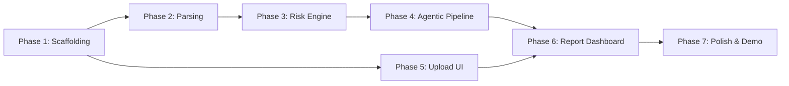

# 🛡️ ContractShield AI — Phased Build Plan
### AlgoVibes · CodeFiesta 24-Hour Hackathon

---

## 📋 What We're Building (TL;DR)

An **AI-powered contract risk analyzer** that:
1. Accepts PDF/DOCX uploads of NDAs and contracts
2. Segments them into clauses (regex + LLM hybrid)
3. Flags risky clauses with severity, explanations, and safer alternatives
4. Computes a weighted risk score (0–100)
5. Presents everything in a stunning dark-themed dashboard

**Stack:** Next.js 14 + Tailwind + shadcn/ui (frontend) · FastAPI + Python (backend) · Google Gemini API (LLM) · ChromaDB (vectors)

---

## 🚀 Phase-by-Phase Build Order

### Phase 1 — Foundation & Scaffolding ✅ (COMPLETED)
**Goal:** Get both apps running with project structure in place.

| Task | Details | Status |
|------|---------|--------|
| Initialize Next.js 16 frontend | App router, Tailwind CSS v4, dark theme tokens, font config | ✅ Completed |
| Initialize FastAPI backend | Modular layout, virtualenv, FastAPI 0.142, uvicorn, PyMuPDF, GenAI | ✅ Completed |
| Define shared types/schemas | Pydantic models (backend), TypeScript types (frontend) aligned 1:1 | ✅ Completed |
| Setup `.env` config | Gemini API key placeholder, ports, upload limits, .env.example | ✅ Completed |
| Create folder structure | Exactly matching PRD architecture (agents, tools, knowledge, models) | ✅ Completed |

**Deliverable:** Both apps build cleanly with 0 errors/warnings, health endpoint returns 200 OK, full type safety wired.

---

### Phase 2 — Backend Core: Document Parsing & Clause Segmentation
**Goal:** Upload a PDF/DOCX → get structured clause data back.

| Task | Details |
|------|---------|
| `document_parser.py` | PDF parsing (PyMuPDF/pdfplumber), DOCX parsing (python-docx) |
| `clause_segmenter.py` | Regex-based segmentation for numbered sections/articles |
| LLM fallback segmentation | Gemini call for unstructured/prose-heavy docs |
| `POST /api/v1/analyze` endpoint | Multipart upload, metadata fields, returns analysis ID |
| Pydantic models (`schemas.py`, `enums.py`) | Request/response models, contract types, severity enums |

**Deliverable:** Upload a PDF → API returns segmented clauses as JSON.

---

### Phase 3 — AI Engine: Risk Detection & Scoring
**Goal:** The intelligence layer — detect risks, score them, suggest fixes.

| Task | Details |
|------|---------|
| `risk_patterns.json` | 50+ regex patterns across 9 risk categories |
| `risk_matcher.py` | Dual detection: regex patterns + LLM contextual analysis |
| `jurisdiction_rules.json` | India, US (CA/DE/NY), UK specific legal rules |
| `clause_library.json` | Risky vs. safe clause examples per category |
| `score_calculator.py` | Weighted risk score formula (category weights × severity × confidence) |
| LLM risk analysis prompts | Contextual risk reasoning with Gemini |
| Risk flag output | Severity, explanation, problematic text, suggested alternative, jurisdiction note |

**Deliverable:** Clauses go in → risk flags with scores, explanations, and suggestions come out.

---

### Phase 4 — Agentic Pipeline: Plan → Act → Verify → Report
**Goal:** Wire up the full agentic orchestration loop.

| Task | Details |
|------|---------|
| `orchestrator.py` | Main agentic loop controller — coordinates all phases |
| `planner.py` | PLAN phase: detect contract type, choose strategy, select modules |
| `analyzer.py` | ACT phase: run segmentation → risk matching → scoring |
| `verifier.py` | VERIFY phase: ground flags to source text, check hallucinations, validate severity |
| Prompt templates | Segmentation, analysis, and verification prompts (from PRD appendix) |
| Full `/api/v1/analyze` response | Complete risk report JSON with all fields |

**Deliverable:** End-to-end pipeline — upload contract → full verified risk report JSON.

---

### Phase 5 — Frontend: Upload Page & Analysis Flow
**Goal:** Beautiful upload experience with real-time progress.

| Task | Details |
|------|---------|
| Landing page (`page.tsx`) | Hero section, tagline "Know What You're Signing" |
| `FileUpload` component | Drag & drop zone, PDF/DOCX support, 10MB limit |
| Metadata form | Contract type dropdown, parties input, jurisdiction selector, user role toggle |
| `ProgressTracker` component | Animated progress bar with step-by-step status |
| API client (`lib/api.ts`) | Axios/fetch wrapper for backend calls |
| Recent analyses list | Show past uploads with scores |

**Deliverable:** Users can upload contracts and see analysis progress.

---

### Phase 6 — Frontend: Risk Report Dashboard
**Goal:** The "wow" screen — stunning risk visualization.

| Task | Details |
|------|---------|
| `RiskScoreGauge` component | Animated circular/bar gauge showing 0–100 score with color bands |
| Risk summary header | Overall score, risk band label, breakdown stats (critical/high/medium/low) |
| `RiskFlagCard` component | Expandable cards per flagged clause: severity badge, problematic text (highlighted), explanation, suggested alternative, jurisdiction note |
| `SafeClauseCard` component | Green-styled cards for safe clauses |
| Report page (`analyze/[id]/page.tsx`) | Full dashboard layout combining all components |
| Design system | Dark theme (`#0a0a0a` bg, severity colors), Inter + JetBrains Mono fonts, glassmorphism cards, smooth animations |

**Deliverable:** Beautiful, interactive risk report dashboard — the demo showstopper.

---

### Phase 7 — Polish, Integration & Demo Prep
**Goal:** Everything works end-to-end, looks amazing, demo-ready.

| Task | Details |
|------|---------|
| End-to-end integration testing | Upload → parse → analyze → display report |
| Sample test contracts | 3 pre-built: Good NDA (~15 score), Risky NDA (~68), Terrible SA (~89) |
| Error handling & edge cases | File too large, empty PDF, API failures, timeout handling |
| UI polish | Micro-animations, hover effects, responsive design, loading states |
| Clause Library page (stretch) | Browse risky vs. safe clause examples |
| PDF export (stretch) | Downloadable risk report |
| Deploy | Vercel (frontend) + Railway/Render (backend) |
| Demo rehearsal | Test with sample contracts, prep talking points |

**Deliverable:** Demo-ready product with 3 sample contracts showing Low/High/Critical risk scenarios.

---

## 📊 Phase Dependencies

> [!TIP]
> **Phases 2–4 (backend) and Phase 5 (frontend) can run in parallel** — this is key for a 24-hour hackathon. Backend builds the API while frontend builds the UI with mock data, then we integrate.

---

## 🎯 Key Decisions Before We Start

| Decision | Options | PRD Recommendation |
|----------|---------|-------------------|
| **LLM Provider** | Gemini Flash / Gemini Pro / GPT-4o-mini / Groq | Gemini 1.5 Flash (fast + free tier) |
| **Agent Framework** | LangGraph / Custom Python orchestrator | Custom (simpler for hackathon) |
| **Embeddings** | Use `all-MiniLM-L6-v2` + ChromaDB or skip semantic matching | Skip for MVP, pure regex + LLM |
| **Frontend approach** | Full Next.js + shadcn or Streamlit for speed | Next.js + shadcn (better demo) |

---

## 🏁 Ready to Start?

Tell me:
1. **Do you have a Gemini API key ready?**
2. **Should we start with Phase 1 (scaffolding)?**
3. **Any phases you want to adjust or skip?**

Let's build this beast. 🔥
